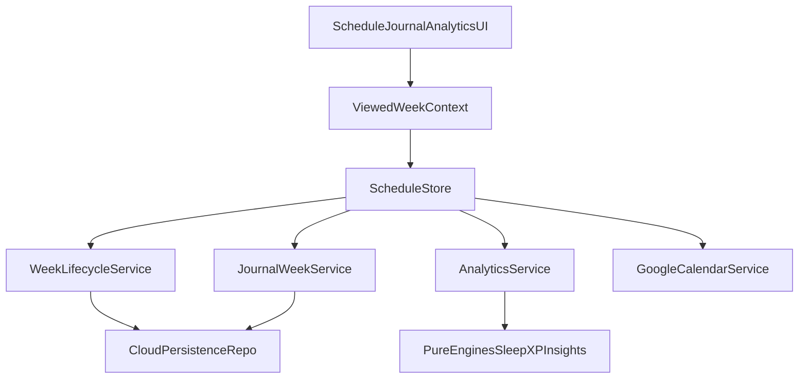

# Cal-Style Tracker Rebuild Plan

## Goals
- Make journal and analytics truly multi-week and historically accurate.
- Rework architecture using Cal.com-like principles: clear separation of concerns, typed boundaries, reusable UI primitives, minimal and fast workflows.
- Add end-to-end and unit regression tests for sleep, week rollover, calendar sync, and history.

## Cal.com Principles To Apply
- Modular boundaries: UI layer -> store/service layer -> pure engines/utils.
- Strong typed contracts at boundaries (input validation + strict DTO-like shapes).
- Reusable design primitives over ad-hoc component styling.
- Feature slicing (schedule, journal, analytics, calendar integration) with minimal cross-coupling.
- Testing as part of architecture: unit for core logic, Playwright E2E for user flows.

## Phase 1: Correctness Foundation (Historical Data + Week Semantics)
- Convert journal storage from single-week object to week-keyed storage in [`C:/Users/goyal/OneDrive/Desktop/planner/planner/src/store/useScheduleStore.ts`](C:/Users/goyal/OneDrive/Desktop/planner/planner/src/store/useScheduleStore.ts):
  - `journal` -> `journalsByWeek: Record<weekKey, Record<DayKey, JournalEntry>>`
  - read/write via `viewedWeekKey = browsingWeekKey || currentWeekKey`
  - keep previous-week journals during rollover.
- Fix archive/rollover source of truth so current-week archive never uses a browsed past week snapshot.
- Make cloud payload/hydration week-safe for journal and week maps in [`C:/Users/goyal/OneDrive/Desktop/planner/planner/src/store/useScheduleStore.ts`](C:/Users/goyal/OneDrive/Desktop/planner/planner/src/store/useScheduleStore.ts).
- Make analytics engines explicitly week-aware by passing week key into date-based computations:
  - [`C:/Users/goyal/OneDrive/Desktop/planner/planner/src/engine/insightsEngine.ts`](C:/Users/goyal/OneDrive/Desktop/planner/planner/src/engine/insightsEngine.ts)
  - [`C:/Users/goyal/OneDrive/Desktop/planner/planner/src/engine/xpEngine.ts`](C:/Users/goyal/OneDrive/Desktop/planner/planner/src/engine/xpEngine.ts)
  - [`C:/Users/goyal/OneDrive/Desktop/planner/planner/src/engine/badgeEngine.ts`](C:/Users/goyal/OneDrive/Desktop/planner/planner/src/engine/badgeEngine.ts)

## Phase 2: UX Cleanup (Cal-style Simplicity)
- Expose one shared week context bar for Schedule/Journal/Analytics in [`C:/Users/goyal/OneDrive/Desktop/planner/planner/src/components/common/DashboardLayout.tsx`](C:/Users/goyal/OneDrive/Desktop/planner/planner/src/components/common/DashboardLayout.tsx) using [`C:/Users/goyal/OneDrive/Desktop/planner/planner/src/components/schedule/WeekNavigator.tsx`](C:/Users/goyal/OneDrive/Desktop/planner/planner/src/components/schedule/WeekNavigator.tsx).
- Rework Calendar panel for clarity and reliability in [`C:/Users/goyal/OneDrive/Desktop/planner/planner/src/components/common/CalendarSync.tsx`](C:/Users/goyal/OneDrive/Desktop/planner/planner/src/components/common/CalendarSync.tsx):
  - selected-day context always visible
  - clear status/error states
  - predictable refresh behavior.
- Standardize dense but readable card patterns (header/action/meta/body) across sleep, journal, and analytics cards.

## Phase 3: Architecture Hardening
- Introduce a lightweight service layer under `src/services/` for orchestration currently spread across components/store:
  - week lifecycle service (archive/rollover)
  - analytics service (aggregate metrics)
  - sleep evaluation service wrapper over pure utils.
- Keep repositories/data access boundaries explicit for cloud persistence calls (`supabase`, `googleCalendar`).
- Ensure engines stay pure and side-effect free (testable deterministic functions).

## Phase 4: Regression Test System (End-to-End)
- Add Playwright for E2E flows and Vitest for logic tests.
- Unit test matrix:
  - sleep calculations and date inference in [`C:/Users/goyal/OneDrive/Desktop/planner/planner/src/utils/sleepUtils.ts`](C:/Users/goyal/OneDrive/Desktop/planner/planner/src/utils/sleepUtils.ts)
  - schedule carry-over/gaps in [`C:/Users/goyal/OneDrive/Desktop/planner/planner/src/engine/computeSchedule.ts`](C:/Users/goyal/OneDrive/Desktop/planner/planner/src/engine/computeSchedule.ts)
  - week/date key helpers in [`C:/Users/goyal/OneDrive/Desktop/planner/planner/src/utils/dateUtils.ts`](C:/Users/goyal/OneDrive/Desktop/planner/planner/src/utils/dateUtils.ts).
- E2E scenarios:
  - previous-week journal editing and retrieval
  - analytics values match archived snapshot
  - rollover from old week on hydrate
  - sleep logging cross-midnight correctness
  - calendar selected-day sync and refresh.

## Delivery Order (Incremental)
1. Historical correctness fixes (store + analytics engines + journal components).
2. Shared week navigation and calendar UX cleanup.
3. Test framework setup and priority regression specs.
4. Service-layer refactor with no behavior change.

## Data Flow Target

## Acceptance Criteria
- Switching to any previous week shows its journal entries and matching analytics.
- Week rollover never overwrites the wrong week when browsing history.
- Sleep calculations are stable for planned and logged cross-midnight cases.
- Calendar panel behavior is consistent for selected date context.
- Regression suite catches rollover/sleep/history regressions before release.